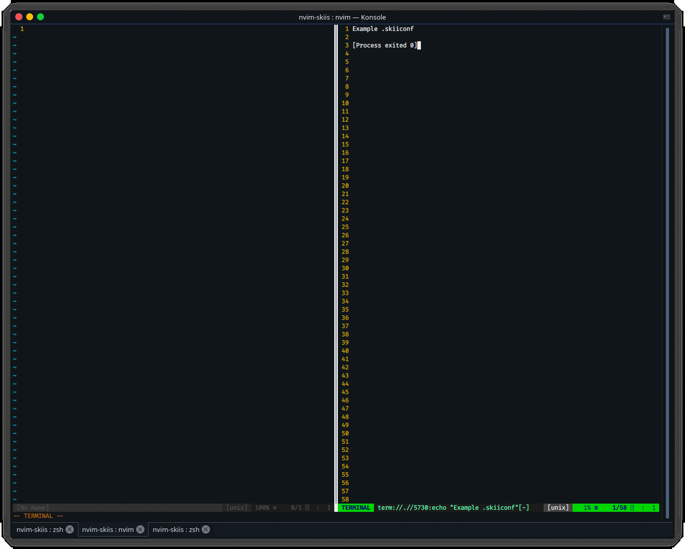

# nvim-skiis

A simple [neovim](https://neovim.io/) plugin for running a predefined terminal command.

## Installation

Clone using git:
```bash
git clone https://github.com/oliversandli/nvim-skiis.git
```

Install in your [remote plugin directory](https://neovim.io/doc/user/remote_plugin.html):
```bash
cd nvim-skiis
cp skiis.py ~/.config/nvim/rplugin/python3/skiis.py # substitute your remote plugin directory here
```

Update remote plugins in `neovim` with the `:UpdateRemotePlugins` command.

## How to Use

1. (Optional) Add a keyboard shortcut to `SkiiRun` in your `init.vim`.
```vimscript
nnoremap <F5> :SkiiRun<return>
```

2. Create a `.skiiconf` file in the current directory with whatever command you wish to run.
```
python my_python_program.py --arg1 --arg2
# or
clang++ my_cpp_program.cpp -o final_build.out
```

3. Open `nvim` in the current directory and press `F5` (or run `:SkiiRun`).


